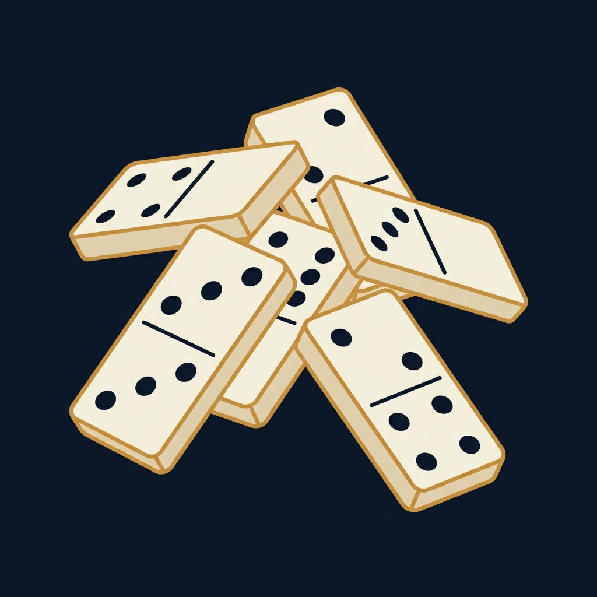

<p align="center">
  
</p>

<h1 align="center">Bones</h1>

<p align="center">
  <a href="https://github.com/dungle-scrubs/bones/actions/workflows/ci.yml"></a>
  <a href="https://opensource.org/licenses/MIT"></a>
</p>

Competitive multi-agent code review game. LLM agents hunt for bugs, security
issues, doc drift, and more in your codebase — then attack each other's
findings. A referee validates everything. First to the target score wins.

## How It Works

```
Setup → Hunt → HuntScoring → Review → ReviewScoring → (loop or Complete)
```

1. **Hunt** — Agents search your codebase for issues and submit findings
2. **HuntScoring** — A referee agent validates each finding (valid, false flag,
   or duplicate)
3. **Review** — Agents dispute other agents' valid findings
4. **ReviewScoring** — Referee resolves disputes
5. **Loop** — If no winner, start next round; otherwise game over

### Scoring

| Event | Points |
|-------|--------|
| Valid finding | +1 |
| False flag | -2 |
| Duplicate | -3 |
| Dispute won | +2 |
| Dispute lost | -1 |

### Design Philosophy: Incentives Over Instructions

The review phase does not prompt agents to treat findings as suspect. The scoring
system already creates that pressure — a successful dispute earns +2 while a
failed one costs -1, so agents are naturally incentivized to be skeptical but
selective. Layering "assume everything is questionable" on top of those mechanics
would stack prompt bias onto game-theoretic incentive, producing carpet-bomb
disputes and noisy referee queues rather than careful analysis.

Instead, the system demands **structured counter-evidence**: every dispute must
articulate a specific, testable counter-argument (e.g., "this path is unreachable
because X" or "this is handled in file Y"). This filters out lazy disputes
without biasing the overall posture. The distinction is the same one auditors
draw between professional skepticism — evaluate rigorously — and reflexive
rejection. The first produces signal; the second produces noise.

## Requirements

- [Bun](https://bun.sh/) v1.1+
- `ANTHROPIC_API_KEY` environment variable

## Installation

```bash
# Install globally via npm
npm install -g bones

# Or run directly with bun
bun install
bun run build
```

## Usage

### Quick game

```bash
# Run a bug-hunting game against a project
bones play ./my-project -c bugs -a 2 -t 5 -m 1
```

### Full game with defaults (3 agents, target 10, 3 rounds)

```bash
bones play ./my-project
```

### Choose a category

```bash
bones play ./my-project -c security
bones play ./my-project -c doc_drift
bones play ./my-project -c test_coverage
bones play ./my-project -c tech_debt
```

### Custom prompt

```bash
bones play ./my-project -c custom -f "Find all SQL injection vectors"
```

### Authentication

```bash
export ANTHROPIC_API_KEY=sk-ant-...
```

### Play options

```
bones play <project_path> [options]

Options:
  --model <provider/model>      Agent model (default: anthropic/claude-sonnet-4-0)
  --referee-model <model>       Referee model (default: same as --model)
  -c, --category <type>         bugs | doc_drift | security | test_coverage | tech_debt | custom
  -f, --focus <text>            Additional focus prompt
  -t, --target <score>          Target score (default: 10)
  -a, --agents <count>          Number of agents (default: 3)
  -m, --max-rounds <n>          Max rounds, 0 = unlimited (default: 3)
  --hunt-duration <seconds>     Hunt phase duration (default: 300)
  --review-duration <seconds>   Review phase duration (default: 180)
  --thinking <level>            Agent thinking level (default: medium)
  --include <paths...>          Only search these directories
  --exclude <paths...>          Additional directories to exclude
```

### Inspect results

```bash
bones status <game_id>      # Scoreboard and game state
bones findings <game_id>    # All findings with verdicts
bones disputes <game_id>    # All disputes with resolutions
bones export <game_id>      # Export to ~/.bones/logs/
bones ui <game_id>          # Interactive terminal UI
```

### Web dashboard

```bash
bones init                  # Install dashboard dependencies
bones serve                 # Start API server (port 8019)
# In another terminal:
cd apps/dashboard && bun dev  # Start dashboard (port 3019)
```

## Building from Source

```bash
git clone https://github.com/dungle-scrubs/bones.git
cd bones
bun install
bun run build
```

The compiled CLI is at `dist/cli.js`. Link it globally:

```bash
bun link
```

## Development

```bash
bun run dev           # Run CLI without building
bun test              # Run all tests (115 tests)
bun test --watch      # Watch mode
bun run lint          # Lint with Biome
bun run lint:fix      # Auto-fix lint issues
bun run typecheck     # Type-check without emitting
```

## Architecture

| Component | Tech |
|-----------|------|
| Runtime | Bun |
| CLI | Commander |
| Database | bun:sqlite |
| API server | Hono |
| Dashboard | Next.js |
| Agent framework | pi-agent-core + pi-ai |

### Key directories

```
src/
├── cli.ts                    # CLI entry point
├── cli/commands.ts           # Command handlers
├── domain/                   # Game, Finding, Dispute, Agent models
├── repository/               # SQLite persistence
├── services/                 # Orchestrator, GameRunner, Scorer
└── agents/                   # Agent factory, runner, and tools
apps/
└── dashboard/                # Next.js web UI
```

## Known Limitations

- macOS and Linux only (uses Bun runtime)
- Requires an Anthropic API key
- Dashboard requires separate `bun install` in `apps/dashboard/`
- Game databases are stored locally at `~/.bones/`

## Contributing

See [CONTRIBUTING.md](CONTRIBUTING.md) for guidelines.

## License

[MIT](LICENSE)
